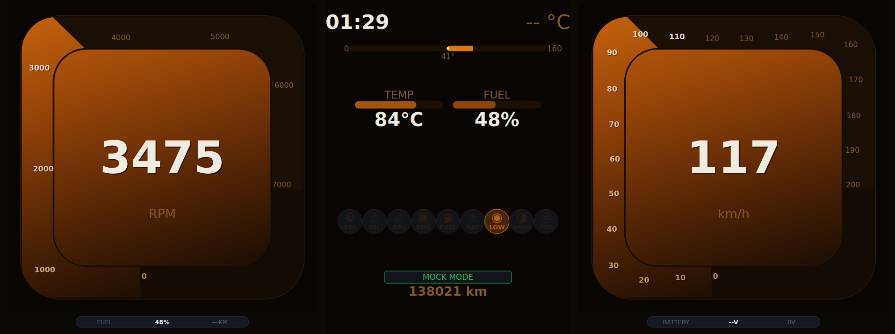

# Instrument Cluster

A custom digital instrument cluster built for the **Raspberry Pi Zero 2W**, designed to replace my car's analog dashboard. The system boots directly into a Qt5 application via a minimal custom Linux OS built with Buildroot — no desktop environment, no systemd, sub-6 second boot time.



---

## Hardware

| Component | Details |
|---|---|
| **SBC** | Raspberry Pi Zero 2W (ARM 32-bit, Cortex-A53) |
| **Display** | HDMI 1920×720 widescreen |
| **CAN interface** | MCP2515 via SPI (SocketCAN) |
| **Storage** | MicroSD (Class 10 / UHS-1 A1) |
| **OS** | Custom Buildroot Linux (no desktop) |

---

## Features

- Sub-6 second boot from power-on to app visible
- Two animated arc gauges — RPM and Speed
- Smooth gradient arc that follows the rounded square perimeter
- Live CAN bus data via SocketCAN
- Temp, fuel, steering angle, warning indicators
- Dark amber/orange colour palette
- Fully proportional layout — adapts to screen resolution at runtime
- Mock mode for desktop development (no hardware needed)

---

## Project Structure

```
EmbeddedInstrumentCluster/
├── InstrumentClusterApp/        ← Qt5 C++ application
│   ├── src/
│   │   ├── main.cpp
│   │   ├── .cpp/.h              ← Component Files/Headers
│   │   ├── resources.qrc        ← Embedded fonts
│   │   └── fonts/               ← DejaVu fonts baked into binary
│   ├── CMakeLists.txt
│   └── CMakePresets.json        ← Desktop + Pi cross-compile presets
│
└── buildroot/                   ← Buildroot OS configuration
    └── board/
        └── custom_rpi/
            └── rootfs_overlay/
                ├── sbin/
                │   └── cluster_init     ← Custom init script (replaces systemd)
                └── usr/
                    └── bin/
                        └── ClusterApp   ← Cross-compiled binary
```

---

## OS Architecture

The system uses **Buildroot** to produce a minimal Linux image. There is no systemd, no desktop environment, and no init system overhead. Boot sequence:

```
Power on
  → GPU firmware (config.txt)
  → Linux kernel (zImage + bcm2710-rpi-zero-2-w.dtb)
  → /sbin/cluster_init  (custom init — mounts /proc /sys /dev)
  → exec /usr/bin/ClusterApp
```

### Key OS settings

| Setting | Value |
|---|---|
| Buildroot version | 2025.02 LTS |
| Kernel | RPi downstream (bcm2709 defconfig) |
| DTB | `bcm2710-rpi-zero-2-w.dtb` |
| Qt backend | `linuxfb` (direct framebuffer, no GPU/X11) |
| Init system | None (custom shell script) |
| CAN driver | SocketCAN + MCP2515 overlay |

---

## Building the App

### Prerequisites

```bash
sudo apt install -y \
  ninja-build g++ cmake \
  qtbase5-dev qtbase5-dev-tools \
  libqt5serialbus5-dev libqt5serialport5-dev
```

### Desktop development (mock CAN data)

```bash
cd InstrumentClusterApp
mkdir build_desktop && cd build_desktop
cmake -DCMAKE_BUILD_TYPE=Debug -G Ninja ..
ninja
./ClusterApp
```

The desktop build uses `DESKTOP_MOCK` mode — gauges animate with simulated sine wave data so it is possible can develop without any hardware.

### Cross-compile for Raspberry Pi

After building the full Buildroot toolchain:

```bash
cd InstrumentClusterApp
mkdir build_pi && cd build_pi

cmake \
  -DCMAKE_TOOLCHAIN_FILE=~/BUILDROOT_PIZERO2W/buildroot/output/host/share/buildroot/toolchainfile.cmake \
  -DCMAKE_BUILD_TYPE=MinSizeRel \
  ..

# Deploy
 make -j$(nproc);  
 cp ~/BUILDROOT_PIZERO2W/InstrumentClusterApp/build_pi/ClusterApp    ~/BUILDROOT_PIZERO2W/buildroot/board/custom_rpi/rootfs_overlay/usr/bin/ClusterApp;
 chmod +x ~/BUILDROOT_PIZERO2W/buildroot/board/custom_rpi/rootfs_overlay/usr/bin/ClusterApp
```

---

## Building the OS Image

```bash
cd buildroot

# First time — full build (~1-2 hours)
make raspberrypizero2w_defconfig
make menuconfig   # apply Qt5, SocketCAN, custom init settings
make

# Subsequent builds — fast (only changed packages)
make

# Output image
output/images/sdcard.img
```

When doing only changes to the App and is pretended to rebuild with the new app

```bash
rm -f output/images/sdcard.img output/images/boot.vfat;
make rpi-firmware-dirclean && make -j$(nproc)
```

---

## CAN Bus

The MCP2515 module connects via SPI with interrupt on GPIO 25. Enabled via Device Tree overlay in `config.txt`:

```ini
dtparam=spi=on
dtoverlay=mcp2515-can0,oscillator=16000000,interrupt=25
```

---

## License

GNU - GPL v3
